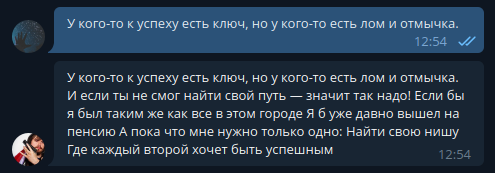
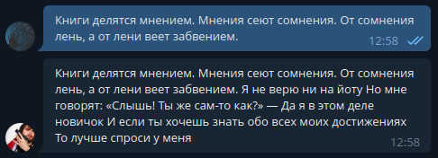
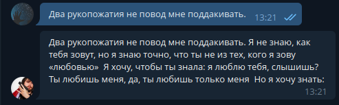
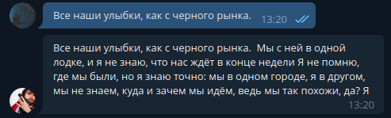
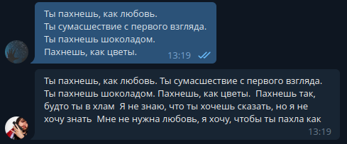
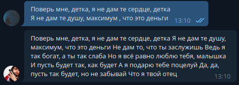

<h1 align="center">POEM GENERATOR</h1>

<h2 align="center">Tools:</h2>

- Datasets from huggingface.
- GPT2Tokenizer.
- GPT3 from Sberbank-ai.
- Aiogram for creating telegram bot with Finite State Machine.

<h2 align="center">Result:</h2>
  

 Oxxxymiron: 

 

 

 

 

 Scryptonite:

 

 

 
  

 Morgenshtern:

